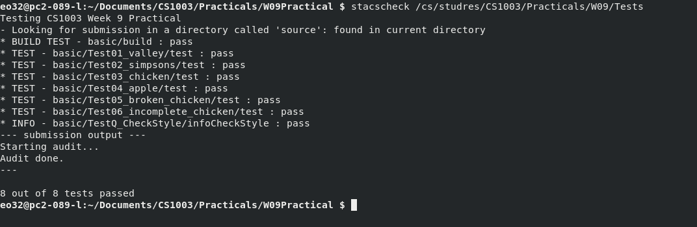
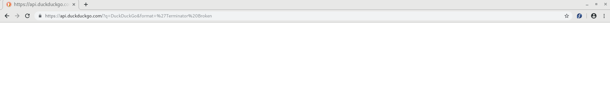
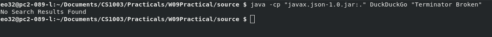
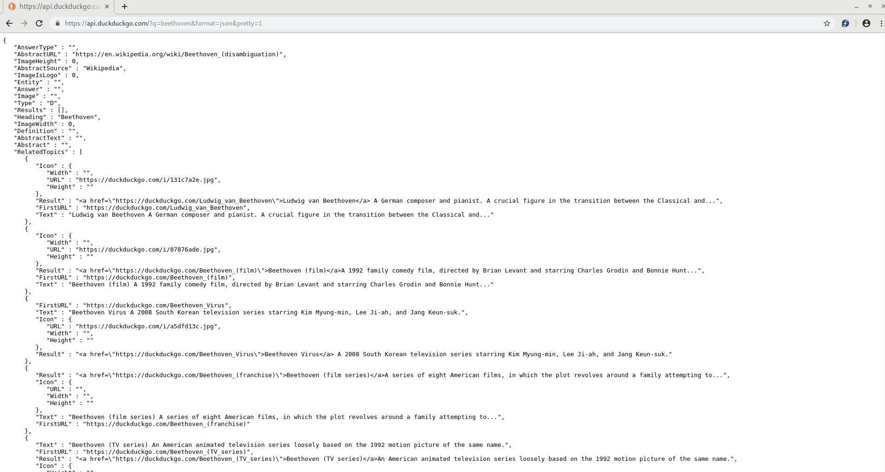
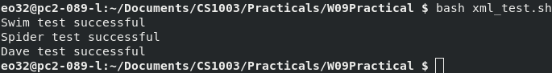
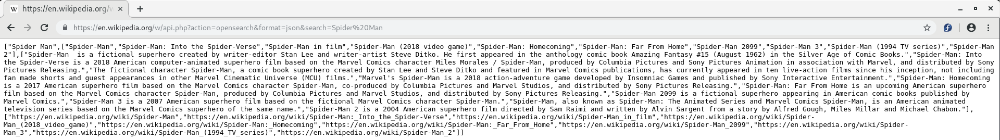
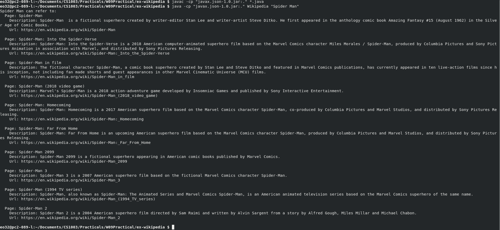

# W09 Practical Report

## Overview

### Part 1

The specification required that a `.json` be read in from disk and print out information in the specified format:

```bash
<args[0]> can refer to:
  - <text>
  - <text>
  - <text>
  * Category: <category_found>
     - <text>
     - <text>
     - <text>
```

 The program needs to take in the name of the file as a command line argument. It is required that if the file is invalid `json` then the user be prompted `Not a valid JSON String!`. It is also required that if the `json` contains an empty text field then it shall be skipped. If the program finds that an either topics sub-array is empty then it shall be skipped.

#### Problem Decomposition

* Input validation
* use `javax` library
* Determine if file is valid `json`
* Loop over all the related topics in array.
* Validate the contents of a topic
* Check for related topics
* Verify that the Related Topics are not empty
* Format each statement that needs to be printed.
* Add correct indentation.

### Part 2

It is required that a query be performed on DuckDuckGo API. e.g.

```https://api.duckduckgo.com/?q=args&format=json```

Using the provided Rest Client. The results of the query will then be obtained as string data and used be processed the exact same as the `json` files in part 1. The argument for this will be the search parameter that will be used in the `api` call.

####  Problem Decomposition

* Input Validation
* Adaptation of first program to be compatible with both `Describe` and `DuckDuckGo` classes.

### Extension HTML

Requires that a webpage with clickable links be created

#### Problem Decomposition

* change places where there is terminal output to file output.
* enclose output in html tags
* obtain addition `json` data for links
* addition of images to web page from `json` data

### Extension XML

Requires that instead of receiving `json` data from the API that `xml` data is requested instead.

#### Problem Decomposition

* rewrite DuckDuckGo `createURL` method so it obtains from format xml
* use `javax.xml-1.3.4.jar` to parse xml and associated functions to parse xml data

### Extension Wikipedia

Requires that an program be created which interacts with Wikipedia API. Take in command line arguments just like the original program but the program shall return a list of related pages, description of that page and the pages `url`.

#### Problem Decomposition

* Learn different Search parameter of Wikipedia API
* change initial program to make it parse the Wikipedia data instead of DuckDuckGo

## Design


It was decided to abstract the process of actually formatting the input into it’s own class (`Processor`) as it would allow the one class to work with both the `Describe` and `DuckDuckGo`. This would allow for `Describe` and `DuckDuckGo` classes to be super simplistic increasing the readability of the main classes. 

### Processor

The constructor of the class takes in the file that is processing it was decided for it to take in two arguments as it would allow for the class to read and process not only files but `json` strings. So this variable informs the class on whether or not the string passed in first is a file path or `json` string. This was designed this way to allow the program to be more versatile and allow it to run both `Describe` and `DuckDuckGo` just using the same unedited `Processor` class. 

As can be seen the `json` produced by DuckDuckGo `RelatedTopics` and `Topics` key share a similar format as they are both arrays of objects with fields called `text`. So it was decided that 1 method would be responsible for printing the output of both and that a parameter indicating the amount of indentation required for the second parameter. This reduces the amount of code for the class as a process which is essentially being done twice is made into one class. 

The `formatCategory` is called when the a `topics` array is found. It checks if the array is empty if it is then it does not print the category heading, else it prints the category heading and `formatTopic` runs on its `topics` array with indentation 2. The reason this was created was so that validation of category array could take place before it call the `formatTopic` method. e.g. checking it actually contains elements.

The `printText` method was created into its of method as it is a process that would be responsible for printing out text found with the `json`, since essentially all text was printed in the same manner the process was generalised into a method. The reason it takes 2 arguments is so it can print `text` and give it a specific indentation.

It was decided for all the methods of processor to just throw errors instead of catch them within the class as to reduce the amount of try catches within the class and allow them to be caught in just one try catch block at the highest level e.g. `Describe` and `DuckDuckGo`.

Though not mentioned by the specification there are results which do not return results. When this is the case the heading is always empty so the processor class will always check that there is a heading before continuing to process `JSON`.

### Extension: HTML

The structure of the practical remained identical to the initial practical. The original code for the practical was modified instead of outputting the terminal the output was enclosed in html tags and outputted to a file with the name of the search parameter with html extension. Additional data was taken from the `json` data e.g. the search link for related topics and also the images if the topic contained any.

### Extension: XML

The structure of the practical remained identical to the initial practical. Since the xml and `json` was structured similar it was decided that there structure in how the data would be extracted would be similar as well. Essentially the `json` code was replaced with corresponding code of xml. 

### Extension: Wikipedia

The structure is almost identical to the initial practical. In the main DuckDuckGo class every reference to DuckDuckGo was changed to Wikipedia and the API link change to the necessary on.

When searched the Wikipedia API returns all the data in `Json` arrays so in stead of reading a object the reading of an array was required instead. Since there existed no categories in the Wikipedia API the category method could be entirely removed.


## Testing

### Stacscheck



### Test Case 1:

When there is no search results found to the API

#### Input

From source directory

```bash
java -cp "javax.json-1.0.jar:." DuckDuckGo "Terminator Broken"
```

#### API Output



#### Program Output




### Test Case 2:

Since it has been established by the `stacscheck` that the program formats data with correct styling it shall be check that the program data matches and parses API data.

### Input

```bash  
java -cp "javax.json-1.0.jar:." DuckDuckGo Beethoven
```

#### API Output

<https://api.duckduckgo.com/?q=beethoven&format=json&pretty=1>



#### Program Output

As can be seen all `json` data has been used and formatted by the program


### Extension: HTML

To test this extension it was shown that all the data present in the initial practical was present in the html and as can be seen this is true

#### Input

```bash
java -cp "javax.json-1.0.jar:." DuckDuckGo Beethoven
```

#### HTML Output


### Extension: XML

To test the XML it was decided to check whether it produced the identical output as initial practical. The following bash script was created and used.

```bash
#!/bin/bash

cd source
javac -cp "javax.json-1.0.jar:." *.java
j1="$(java -cp javax.json-1.0.jar:. DuckDuckGo 'Swim' 2>&1 )"
j2="$(java -cp javax.json-1.0.jar:. DuckDuckGo 'Spider' 2>&1 )"
j3="$(java -cp javax.json-1.0.jar:. DuckDuckGo 'Dave' 2>&1 )"

cd ../ex-xml
javac -cp "javax.xml-1.3.4.jar:." *.java
w1="$(java -cp javax.xml-1.3.4.jar:. DuckDuckGo 'Swim' 2>&1 )"
w2="$(java -cp javax.xml-1.3.4.jar:. DuckDuckGo 'Spider' 2>&1 )"
w3="$(java -cp javax.xml-1.3.4.jar:. DuckDuckGo 'Dave' 2>&1 )"

if [ "$j1" == "$w1" ]; then
  echo "Swim test successful"
else
  echo "Swim test failed"
fi

if [ "$j2" == "$w2" ]; then
  echo "Spider test successful"
else
  echo "Spider test failed"
fi

if [ "$j3" == "$w3" ]; then

  echo "Dave test successful"
else
  echo "Dave test failed"
fi
```

Navigate to root directory of the project and run

```bash
bash xml_test.sh
```

#### Output



### Extension: Wikipedia

Since the API works in the same manner as initial it can be seen that it does indeed properly send the correct requests out to the API. To see if the program works we just need to navigate to the expected address the program will gain the data from and compare that to the output

#### API Output



#### Output

As can be seen all the API data has been used and processed the data from the expected source



## Evaluation

The specification for part 1 required that a program which was capable of taking a file path of a `json` file as an argument and processing the contained data into a specific format was created. It was required that it would skip entry entries of data with the `json` file and notify the user and terminal the program if the `json` data was found to be in an invalid format. From testing and the `stacscheck` it can be seen that the program fulfils these properties. It is shown from the various tests cases that if the `json` is formatted into the expected output format.

Since the same class is responsible for input or `json` data for both Part 1 and Part 2. Then it can be concluded that the same formatting and input validation that happens in Part 1 happens on the Part 2  and it can be seen from the example tests that the same does happen.

## Conclusion

In this practical a program capable of formatting `json` data into a specified format was created, this program was also capable of interacting with `DuckDuckGo` API and retrieving the dajava -cp "ta produced from queries to the API.

`git` was used for version control for this project. From previous feedback it has been seen that use of git for displaying extension made program difficult to mark so it was not used to access extensions for this practical.

### Difficulties

* Upon the initial running of the `stacscheck` it was seen that the program that the `stacschecker` was unable to find the directory containing the code. At the time the directory was named `src` and the `stacscheck` would not work until the program was renamed `source`. 
* It was found that the code provided for the REST Client did not met the style checking standard required by the `stackcheck`. So this class was edited until it met the styling guidelines.
* The `javax.xml-1.2.4.jar` proved hard to work with as there existed limited resources on how to use it.
* Finding the necessary Wikipedia API which gave desired results was very time consuming.

### Given More Time

* A GUI which allows the user to search and then receive the output (including images) could have been produced e.g. a search engine.
* The program could have been redesigned to work with multiple APIs and have a lexicon be provided giving the structure of how received data from the API should be formatted.
* A `stacscheck` could have been produced for extensions

